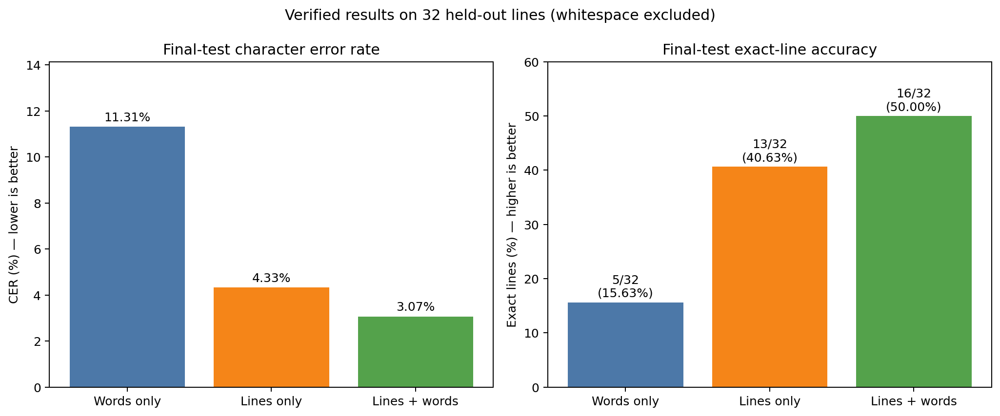

# HTR-VT for Hebrew Handwriting

This repository adapts the official [HTR-VT](https://github.com/Intellindust-AI-Lab/HTR-VT) implementation to offline Hebrew handwriting recognition. We compare three training granularities:

1. isolated words only;
2. full text lines only;
3. a combined set of words and lines.

The base source was compared with upstream commit `f21bf20` (22 January 2026). The Hebrew data pipeline, manual annotation interface, experiment runners, resumable checkpoints, evaluation scripts and plots are our additions. Curated data that was already committed remains available in the repository; newly generated local data, model checkpoints and run outputs are excluded from Git.

## Model and Hebrew preprocessing

The recognition flow is:

`image -> modified ResNet-18 -> 4-layer ViT encoder -> character logits -> CTC decoding`

Images are resized to height 64 and padded to a configured width. For right-to-left Hebrew, each image is mirrored horizontally while its UTF-8 transcription remains in logical reading order. Whitespace is removed from all labels because the model alphabet has no space class. Consequently, the reported CER and exact-line accuracy do not score spaces.

## Data preparation

Every image requires a same-name UTF-8 transcription:

```text
data/<dataset>/sample_0001.png
data/<dataset>/sample_0001.txt
```

We created our Hebrew data manually. We transcribed the source lines, marked line and word regions with the interface in `manual_segmenter/`, exported matching PNG/TXT pairs, and reviewed the exported data for segmentation and transcription errors.

The portable tools used for the page-to-lines-to-words workflow are now available in [`tools/segmentation/`](tools/segmentation/README.md): **Manual Segmenter PDF v4** for drawing and transcribing line crops, and **Word Segmenter Auto v3** for proposing word crops from line PNG/TXT pairs with punctuation handling and manual review. See the linked guide for startup commands and the complete workflow.

```powershell
python manual_segmenter/server.py
# Open http://127.0.0.1:8765, load a page, draw RTL boxes,
# type the transcriptions, choose an output directory and save.
```

The scripts `verify_transcriptions.py`, `verify_training_batch.py` and `verify_visual_ltr.py` help detect missing pairs, empty or invalid UTF-8 labels, and wrong RTL orientation before training. They accept repository-relative dataset paths and do not rely on machine-specific directories:

```powershell
python verify_transcriptions.py data/HarmonitManualTrain data/HarmonitManualTrainOnlyWord
python verify_training_batch.py data/HarmonitManualTrain --strip-whitespace
python verify_visual_ltr.py data/HarmonitManualTrain --output output/rtl_preview.png
```

Main folders used by the experiments:

- lines: `arielManual`, `RockManual`, `AgadaManual`, `HarmonitManualTrain`;
- words: `arielOnlyWord`, `RockOnlyWord`, `agadaOnlyWord`, `HarmonitManualTrainOnlyWord`;
- validation/checkpoint selection: `HarmonitManualTest`;
- final evaluation only: `HarmonitManualFinalTest` (32 lines).

The final set is never used to select a checkpoint. Its labels are also excluded when constructing the model alphabet.

## Environment

`environment.yaml` describes the original environment. Our Windows runs were verified with Python 3.11.9, PyTorch 2.11.0 + CUDA 12.8 and torchvision 0.26.0:

```powershell
python -m venv .venv
.\.venv\Scripts\Activate.ps1
python -m pip install torch==2.11.0 torchvision==0.26.0 --index-url https://download.pytorch.org/whl/cu128
python -m pip install -r requirements-hebrew.txt
python -c "import torch; print(torch.__version__, torch.cuda.is_available())"
```

Use the PyTorch wheel appropriate for your CUDA driver. Full training requires a CUDA GPU.

## Repository layout

| Path | Purpose |
|---|---|
| `data/` | Paired handwriting images and UTF-8 transcriptions |
| `manual_segmenter/` | Browser-based line and word annotation tool |
| `train.py` | Original training entry point |
| `run_paper_recipe_experiments.ps1`, `train_words_3000.py` | Resumable experiment orchestration and the extended training loop |
| `evaluate_line_folder.py` | Held-out line-level evaluation |
| `evaluate_training_cer.py` | CER evaluation on the training sources stored in a checkpoint |
| `plot_training_curves.py` | English training, validation and comparison plots |
| `output/` | Local checkpoints, metrics and plots; ignored by Git |

## Experiment flows

### Adapted baseline

Our baseline uses AdamW, learning rate `5e-4`, weight decay `1e-4` and light rotation augmentation. The strongest saved baseline was trained on both word and line samples. `run_controlled_words_baseline.ps1` provides a data-matched words-only baseline with the same outer protocol as the paper-style runner.

### Paper-style recipe

`run_paper_recipe_experiments.ps1` runs words-only, lines-only and combined training for 20,000 steps each. It uses a compute-adapted batch size of 8 and image size 64x1024, while enabling the main training components described in the paper:

- SAM over AdamW (`rho=0.05`);
- peak learning rate `1e-3`, 1,000-step warm-up and cosine decay to `1e-7`;
- weight decay `0.5`;
- EMA decay `0.9999`;
- span masking ratio `0.4`, maximum span length 8;
- projective, erosion/dilation, color-jitter and elastic augmentations, each sampled with probability 0.5.

```powershell
powershell -ExecutionPolicy Bypass -File .\run_paper_recipe_experiments.ps1
```

The runner closes cleanly after each data-loader epoch and resumes from a full-state checkpoint containing the raw model, optimizer, EMA and random-generator states. Splitting into chunks does not change the global learning-rate horizon. If the machine stops, execute the same command again to resume.

`run_paper_recipe_experiments_to_30000.ps1` optionally continues completed 20,000-step runs to 30,000 in separate output directories. This continuation changes the cosine horizon and should be reported as a separate follow-up experiment, not as a from-scratch 30,000-step reproduction.

The paper used a substantially larger training budget; therefore these are paper-style, compute-adapted experiments rather than an exact reproduction.

### Evaluation and graphs

Evaluate a selected checkpoint on the final line set:

```powershell
python evaluate_line_folder.py `
  --checkpoint output/<run>/run/best_model.pth `
  --data-dir data/HarmonitManualFinalTest `
  --output-dir output/<run>_final
```

Calculate CER on the training folders recorded in a checkpoint:

```powershell
python evaluate_training_cer.py `
  --checkpoint output/<run>/run/best_model.pth `
  --output-dir output/<run>_train
```

The experiment runners call `plot_training_curves.py` after completion. The generated plots show training/validation loss and validation CER/accuracy with optimizer steps on the x-axis.

Historical metric CSV files use the legacy column names `test_loss`, `test_cer` and `test_word_accuracy`. In the three main experiment runners these columns describe the **validation** set used for checkpoint selection; `test_word_accuracy` means exact-sample accuracy, which is exact-line accuracy when the samples are complete lines.

## Verified baseline results

The following selected checkpoints were evaluated independently on the same 32 final-test lines. Spaces are excluded from every metric.

| Training data | Training steps | Best step | Exact lines | CER | Character accuracy |
|---|---:|---:|---:|---:|---:|
| Words only: four word datasets | 20,000 | 12,086 | 5/32 (15.63%) | 11.31% | 88.69% |
| Lines only (continued; numerical failure late in training) | 20,000 | 5,821 | 13/32 (40.63%) | 4.33% | 95.67% |
| Lines + words | 20,000 | 15,341 | **16/32 (50.00%)** | **3.07%** | **96.93%** |

These historical runs used the same batch size (16), optimizer, learning rate, image size, seed and light-rotation augmentation, and all reached a recorded step count of 20,000. They are not a perfectly controlled ablation: dataset sizes and effective numbers of epochs differ, and the lines-only continuation suffered numerical failure. They nevertheless show the main empirical pattern: in our experiments, models exposed to full lines performed substantially better on line recognition than the word-only model, and the sufficiently trained mixed dataset produced our best checkpoint.

Correction (9 September 2026): the earlier summary omitted `output/manual_lines_10000_rotation_continued_20000/run`, which resumed the 10,000-step lines-only baseline and reached step 20,000 using our adapted recipe, not the paper-style recipe. Its best checkpoint remained at step 5,821 and is byte-identical to the earlier best checkpoint, so final-test metrics are unchanged. Training loss first became nonfinite at step 18,159; the last checkpoint at step 20,000 contains nonfinite model tensors. Thus 20,000 is the recorded run length, not 20,000 healthy training updates. See the [audit](docs/results/lines_only_continuation_audit.md).



The figure above reports the same held-out results as the table. A second figure with the recorded validation curves is available at [`docs/results/verified_validation_curves.png`](docs/results/verified_validation_curves.png). All curves include records through step 20,000. The lines-only continuation and its numerical failure are included explicitly; the figure does not imply equally successful training across the three runs.

During verification we found that an earlier implementation of chunked paper-style training used the end of each chunk, rather than the global target step, as the cosine-schedule horizon. The code in this repository now uses the global `--steps` value. Metrics created by the earlier chunk-local implementation must not be described as a faithful reproduction; rerun the paper-style script to regenerate corrected results.

See [FINAL_TEST_REPORT.md](FINAL_TEST_REPORT.md) for the detailed baseline evaluation and its limitations.

## Adapting to another handwriting style

1. Create disjoint train, validation and final-test pages before segmentation.
2. Export verified line and word PNG/TXT pairs.
3. Run a smoke test and visually inspect a mirrored training batch.
4. Train the three granularities with the same seed, image size, batch size and step budget.
5. Select checkpoints only on validation CER.
6. Evaluate the selected checkpoints once on the final set.
7. Report CER, exact-line accuracy, dataset sizes and all deviations from the paper.

Absolute CER depends heavily on writer variability, dataset size and segmentation quality. A future step-matched comparison is more informative for isolating the effect of sample type than expecting another writer to reproduce our exact percentages.

## References

- Y. Li et al., “HTR-VT: Handwritten Text Recognition with Vision Transformer,” *Pattern Recognition*, 158, 110967, 2025. [Paper](https://www.sciencedirect.com/science/article/pii/S0031320324007180) · [arXiv](https://arxiv.org/abs/2409.08573)
- [Official HTR-VT repository](https://github.com/Intellindust-AI-Lab/HTR-VT)
